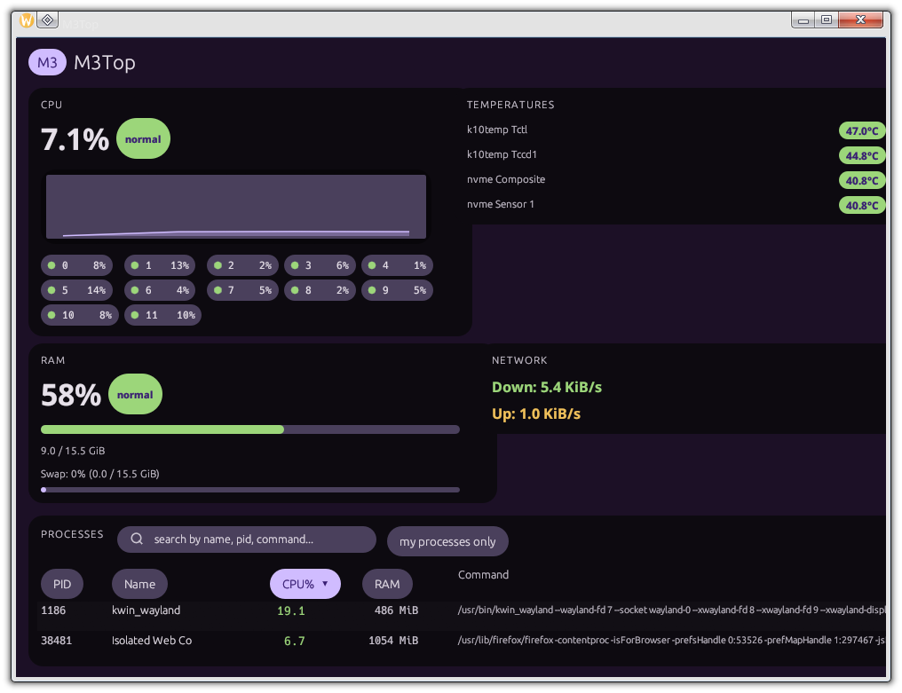

# M3Top

A desktop system monitor for Linux, built with Rust and [egui](https://github.com/emilk/egui), styled after **Material 3 Expressive**: rounded cards, dynamic accent colors, and springy/bouncy motion.



## Features

- **CPU** — total load + per-core percentages, with a live history graph and a level badge (normal / moderate / high).
- **RAM / Swap** — usage bar, GiB used/total, swap usage (or "Swap: none").
- **Temperatures** — real sensor readings from `/sys/class/hwmon` (e.g. `k10temp Tctl`, `nvme Composite`), prioritized over the often-unhelpful generic `acpitz` zone from `/sys/class/thermal`.
- **Network** — aggregate download/upload rate across interfaces (loopback excluded).
- **Processes** — searchable, sortable (click a column header) table: PID, name, CPU%, RAM, command. Filterable to just your own processes.
- **Material 3 Expressive UI** — pill-shaped chips and search bar, tonal surfaces instead of hard borders, spring-animated ("bouncy") resizing that never lets cards overlap their neighbors (excess spring energy turns into a visible squash instead).
- Dark theme, tight "shoulder to shoulder" layout, no network access required (everything is read locally from `/proc` and `/sys`).

## Project layout

```
crates/
  core/     — m3top-core: metric collection from /proc and /sys. No UI dependencies,
              pure data structures (CpuStats, MemStats, ProcessInfo, ThermalZone, ...).
  desktop/  — m3top: the egui/eframe GUI application.
```

`core` never panics on a missing `/proc` or `/sys` path — unavailable sources show up as `None` / an empty list, and the UI renders "unavailable" instead of crashing.

## Building & running

Requires a recent Rust toolchain (`rustup` recommended).

```bash
cargo build --release
cargo run -p m3top --release
```

Run the test suite:

```bash
cargo test --workspace
```

There's also a plain-text CLI example for the core crate (no GUI needed), useful for quick diagnostics:

```bash
cargo run -p m3top-core --example cli
```

## Platform notes

Currently developed and tested on Arch Linux. The core crate only depends on standard `/proc` and `/sys` paths that are common across Linux distributions, so other distros should work out of the box; a universal AppImage build and a port to Android are planned next.

## License

See individual dependency licenses. The bundled `NotoSans-Bold.ttf` font is licensed under [Apache License 2.0](https://openfontlicense.org) (Noto Sans by Google).
